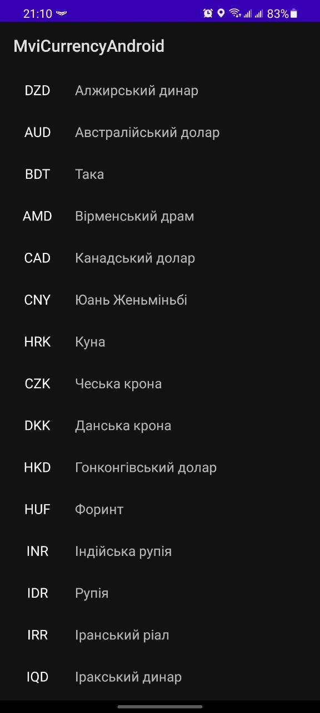
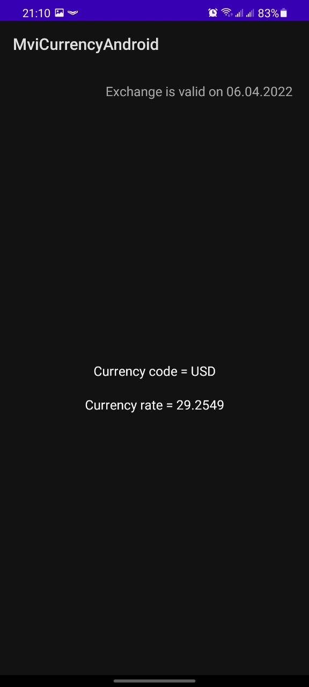
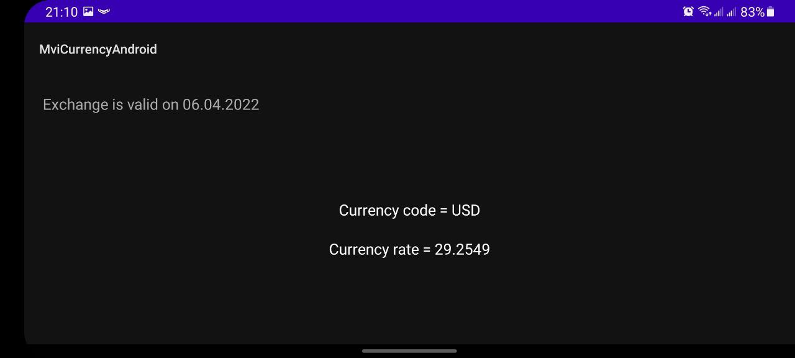
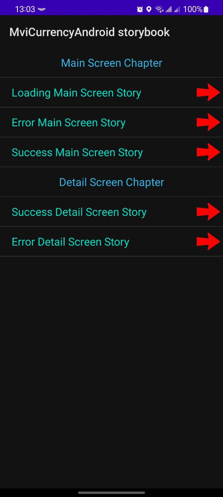
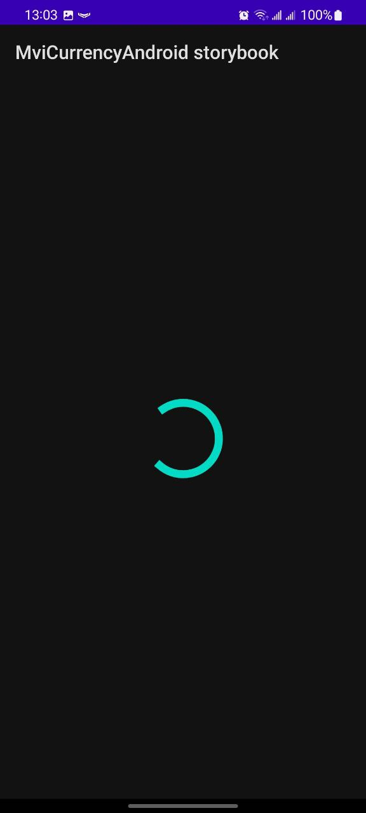

# Redux-Currency-Android

Simple app that shows exchange rate relative to UAH, using data
from https://bank.gov.ua/NBUStatService/v1/statdirectory, structured according to the Redux pattern.

This app contains the implementation of network requests using Retrofit + Coroutine and parse XML as
response from server.

  

  

  

Added Storybook flow - to cover the project with UI tests and make it easy to show all UI states.

  

  

  

For launching Storybook flow - need to choose Build Variants -> storybook. This Build Variant will
open new entry point -> StorybookActivity.

Also added CI which run Unit tests and UI tests exactly in Storybook flow.
